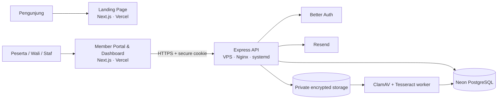

# Platform Ta’aruf Sunnah

<p align="center">
  <strong>Platform ta’aruf digital dengan persetujuan berlapis, keterlibatan wali, dan pembukaan data secara bertahap.</strong>
</p>

<p align="center">
  
  
  
  
  
</p>

Platform Ta’aruf Sunnah dirancang untuk membantu muslim dan muslimah menjalani proses ta’aruf secara terarah—bukan sebagai aplikasi kencan, katalog foto, atau ruang chat bebas. Produk memisahkan keputusan peserta, wali, mediator, dan petugas agar setiap tindakan memiliki batas kewenangan serta jejak audit.

> [!IMPORTANT]
> Platform ini masih dalam pengembangan aktif. Klaim “sesuai syariat” tidak menggantikan peninjauan dan pengesahan SOP oleh Dewan Syariah yang memiliki mandat formal.

Dokumen konsep produk selengkapnya tersedia di [Konsep Platform Ta’aruf Berbasis Syariat Islam](./Konsep_Platform_Taaruf_Berbasis_Syariat_Islam-Revisi_Biodata_Terbaru.md).

## Prinsip Produk

- **Dual consent** — keputusan akhwat dan wali dicatat terpisah; salah satu pihak dapat menolak.
- **Progressive disclosure** — identitas, foto, kesehatan, dan data sensitif tidak dibuka sekaligus.
- **Satu proses aktif** — peserta difokuskan pada satu proses ta’aruf setelah persetujuan berlapis terpenuhi.
- **Role-based access** — peserta, wali, mediator, admin gender, dan super admin memperoleh ruang serta kewenangan berbeda.
- **Auditable by design** — akses dokumen, perubahan profil, persetujuan, dan tindakan petugas menghasilkan jejak audit.
- **Privacy first** — dokumen identitas disimpan terenkripsi di luar webroot dan tidak memiliki URL publik permanen.

## Arsitektur



| Aplikasi | Workspace | Port lokal | Target deployment |
| --- | --- | ---: | --- |
| Landing | `apps/landing` | `3000` | Vercel · `platformtaarufsunnah.my.id` |
| Portal dan dashboard | `apps/dashboard` | `3001` | Vercel · `dashboard.platformtaarufsunnah.my.id` |
| API dan auth | `apps/api` | `3003` | VPS · `api.platformtaarufsunnah.my.id` |
| Document worker | `apps/api/src/worker.mjs` | — | VPS · systemd |

Dashboard tidak mengakses database langsung dari React Server Components. Seluruh data operasional melewati API dengan loading skeleton, retry, error boundary, dan state pemulihan.

## Pengalaman Berdasarkan Peran

| Peran | Pengalaman utama |
| --- | --- |
| Peserta ikhwan/akhwat | Portal personal, biodata bertahap, rekomendasi terbatas, pengajuan, dan perjalanan ta’aruf. |
| Wali | Portal ringan untuk hubungan wali, persetujuan, jadwal nazhor, dan riwayat keputusan. |
| Mediator | Dashboard penugasan, dialog terarah, pemeriksaan referensi, dan pendampingan proses. |
| Admin ikhwan/akhwat | Antrean verifikasi dan akses peserta sesuai gender serta kewenangan. |
| Super admin | Operasional sistem, staf internal, kebijakan, moderasi, dan audit. |

## Status Implementasi

Yang sudah tersedia di codebase:

- Landing page dan portal/dashboard responsif berbasis role.
- Registrasi, login, verifikasi email, reset password, session database, dan 2FA staf melalui Better Auth.
- Google OAuth untuk login akun lama dan pendaftaran peserta baru dengan role yang divalidasi server-side.
- Biodata bertahap dengan enkripsi untuk jawaban sensitif dan perhitungan progres.
- Upload JPEG/PNG maksimal 5 MB ke penyimpanan privat terenkripsi.
- Worker pemeriksaan malware dan OCR dokumen.
- API health/readiness, CORS allowlist, Helmet, request logging, dan error envelope.
- Skema database untuk wali, rekomendasi, consent, proses ta’aruf, nazhor, moderasi, kebijakan, notifikasi, dan audit.

Sebagian workflow lanjutan pada skema—seperti matching penuh, persetujuan bertingkat, dialog mediator, nazhor, khitbah, serta moderasi—masih memerlukan endpoint dan UI operasional lanjutan sebelum production launch.

## Struktur Repository

```text
platform-taaruf/
├── apps/
│   ├── landing/       # Landing page publik
│   ├── dashboard/     # Auth, portal peserta/wali, dan dashboard staf
│   └── api/           # Express API, Better Auth, Drizzle, dan worker
├── deploy/            # Unit systemd dan konfigurasi Nginx
├── drizzle/           # Migration dan metadata PostgreSQL
├── design.md          # Design system dan arah visual
├── .env.example       # Daftar environment variable tanpa secret
└── Konsep_*.md        # Konsep produk serta biodata lengkap
```

## Prasyarat

- Node.js `22` atau lebih baru
- npm
- PostgreSQL atau project Neon
- ClamAV, Tesseract OCR, serta language pack `ind` untuk document worker

Untuk deployment VPS Jakarta, gunakan database di region yang dekat—misalnya Neon Singapore—untuk menghindari timeout dan latensi lintas benua.

## Memulai Secara Lokal

### 1. Instal dependency

```bash
git clone https://github.com/sqcb002-spec/platform-taaruf.git
cd platform-taaruf
npm ci
```

### 2. Siapkan environment

```bash
cp .env.example .env.local
```

Isi `.env.local` dengan kredensial development. API membaca konfigurasi dari `process.env`, sedangkan environment publik Next.js harus tersedia pada workspace terkait atau dikonfigurasi melalui platform deployment.

Jangan pernah commit `.env.local`, connection string database, token email, maupun kunci enkripsi.

### 3. Jalankan migration

```bash
npm run db:migrate --workspace=@taaruf/api
```

### 4. Jalankan service

Buka tiga terminal terpisah:

```bash
npm run dev:landing
npm run dev:dashboard
npm run dev:api
```

Alamat development:

- Landing: `http://localhost:3000`
- Portal/dashboard: `http://localhost:3001`
- API: `http://localhost:3003`
- Health check: `http://localhost:3003/health`
- Database readiness: `http://localhost:3003/ready`

## Environment Variables

| Variabel | Scope | Keterangan |
| --- | --- | --- |
| `DATABASE_URL` | API, worker | Connection string PostgreSQL/Neon. |
| `BETTER_AUTH_SECRET` | API | Secret autentikasi minimal 32 karakter. |
| `API_PUBLIC_URL` | API | Origin publik backend. |
| `DASHBOARD_ORIGIN` | API | Origin dashboard untuk auth dan CORS. |
| `LANDING_ORIGIN` | API | Origin landing yang dipercaya. |
| `NEXT_PUBLIC_API_URL` | Dashboard | Base URL API dari browser. |
| `NEXT_PUBLIC_DASHBOARD_URL` | Landing | Tujuan CTA pendaftaran dan login. |
| `NEXT_PUBLIC_LANDING_URL` | Dashboard | URL kembali ke landing. |
| `RESEND_API_KEY` | API | Pengiriman email transaksional. |
| `EMAIL_FROM` | API | Identitas pengirim yang telah diverifikasi. |
| `GOOGLE_CLIENT_ID` | API | OAuth Client ID Google; server-only. |
| `GOOGLE_CLIENT_SECRET` | API | OAuth Client Secret Google; server-only. |
| `PRIVATE_STORAGE_PATH` | API, worker | Direktori privat di luar webroot. |
| `DOCUMENT_ENCRYPTION_KEY` | API, worker | Material kunci enkripsi dokumen dan OCR. |
| `NIK_HMAC_KEY` | API | Kunci fingerprint NIK. |

Lihat [.env.example](./.env.example) sebagai sumber daftar variabel terbaru.

## Perintah Penting

| Perintah | Fungsi |
| --- | --- |
| `npm run build` | Build seluruh workspace. |
| `npm run build:landing` | Build landing saja. |
| `npm run build:dashboard` | Build portal/dashboard saja. |
| `npm run build:api` | Bundle Express API. |
| `npm test` | Menjalankan test seluruh workspace. |
| `npm run lint` | ESLint dan TypeScript checking. |
| `npm run db:generate --workspace=@taaruf/api` | Membuat migration Drizzle. |
| `npm run db:migrate --workspace=@taaruf/api` | Menjalankan migration database. |
| `npm run worker --workspace=@taaruf/api` | Menjalankan document worker. |

### Seed super admin

```bash
npm run seed:super-admin --workspace=@taaruf/api -- admin@example.com
```

Seed bersifat idempotent: akun dibuat atau dipromosikan menjadi `super_admin`, email ditandai terverifikasi, dan perubahan dicatat pada audit log. Jika akun baru dibuat, sistem juga mengirim tautan pengaturan kata sandi.

## Google OAuth

Integrasi menggunakan social provider Better Auth. Akun Google yang emailnya sama dengan akun lama dapat ditautkan oleh Better Auth setelah email dari provider terverifikasi. Pendaftaran Google baru tetap meminta pilihan Ikhwan/Akhwat dan konfirmasi usia; data tersebut dibawa melalui OAuth state lalu divalidasi oleh backend.

### Konfigurasi Google Cloud

1. Buka **Google Cloud Console → Google Auth Platform**.
2. Konfigurasikan branding, audience, dan test users selama aplikasi masih dalam mode pengujian.
3. Buat OAuth Client dengan tipe **Web application**.
4. Tambahkan authorized JavaScript origins:
   - `http://localhost:3001`
   - `https://dashboard.platformtaarufsunnah.my.id`
5. Tambahkan authorized redirect URIs berikut secara persis:
   - `http://localhost:3003/api/auth/callback/google`
   - `https://api.platformtaarufsunnah.my.id/api/auth/callback/google`
6. Simpan Client ID dan Client Secret sebagai `GOOGLE_CLIENT_ID` serta `GOOGLE_CLIENT_SECRET` pada environment API.

> [!CAUTION]
> Jangan menaruh Google Client Secret di Vercel dashboard, variabel `NEXT_PUBLIC_*`, source code, atau repository. Callback dibentuk dari `API_PUBLIC_URL`; nilainya harus memakai origin API production yang benar.

Provider otomatis disembunyikan dari halaman masuk/daftar jika kedua environment variable Google belum tersedia. Mengisi hanya salah satunya akan membuat API gagal startup agar kesalahan konfigurasi tidak lolos diam-diam.

## Deployment

### Vercel

Buat dua project terpisah dengan root directory:

- `apps/landing`
- `apps/dashboard`

Pasang environment variable publik sesuai aplikasi, lalu arahkan domain setelah deployment berstatus `Ready`.

### VPS

API berjalan pada `127.0.0.1:3003` dan tidak diekspos langsung. Nginx menangani trafik publik, sedangkan systemd menjaga API serta worker tetap aktif.

Template deployment tersedia di [`deploy/`](./deploy):

- `platform-taaruf-api.service`
- `platform-taaruf-v2-worker.service`
- `nginx-platform-taaruf-api.conf`

Urutan rilis yang disarankan:

1. Jalankan migration pada database target.
2. Build API dan pasang environment production.
3. Aktifkan API serta worker pada port internal.
4. Pastikan `/health` dan `/ready` berhasil.
5. Uji auth, biodata, upload, serta akses dokumen.
6. Baru arahkan DNS dan hentikan aplikasi lama.

## Model Keamanan

- Session cookie hanya digunakan melalui HTTPS pada production.
- CORS dibatasi pada landing dan dashboard yang telah dikonfigurasi.
- Password minimum 12 karakter dan akun staf mendukung 2FA.
- Dokumen diverifikasi berdasarkan magic bytes, bukan hanya ekstensi file.
- File privat menggunakan AES-256-GCM dan permission filesystem terbatas.
- Dokumen identitas dikirim dengan `Cache-Control: private, no-store`.
- Akses dokumen dibatasi berdasarkan pemilik, admin gender, atau super admin.
- Data sensitif biodata disimpan sebagai encrypted payload.
- Setiap akses penting menghasilkan audit log.

## Governance Syariah dan Privasi

Developer menerjemahkan SOP menjadi aturan sistem; developer bukan penentu hukum fikih. Sebelum production launch, proyek membutuhkan Dewan Syariah dan Etik formal, SOP berversi, mekanisme konflik kepentingan, serta peninjauan privasi/DPIA untuk pemrosesan data berisiko tinggi.

Gunakan klaim publik yang proporsional selama proses tersebut belum selesai:

> “Platform dirancang untuk memfasilitasi proses ta’aruf dengan menjaga prinsip-prinsip syariat.”

---

<p align="center">
  Dibangun sebagai ikhtiar teknologi yang menjaga adab, amanah, dan privasi.
</p>
